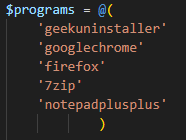

# chocolately-batch-install-script
Installs all programs found in the programs.txt file using the Chocolately package manager.

Useful if you have to reinstall Windows.

Outputs progress and informs you at end if any failed.

**Chocolately will install automatically if not already installed**

## Steps

1. Add the programs you want to install into the programs.txt file.
    
    _Google "choco [program name]" to find its package name. Review before installing_

    * **Alternatively**, set ```$programs``` to an array of programs you want to install. For example:

       
2. Run Powershell as administrator and locate the script.
3. Run the script:
    ```.\InstallPrograms.ps1```

## InstallAdd.ps1 script

This script will use Chocolately to install the program as norma, however, if it doesn't fail it will add the program name to the programs list (programs.txt).

Add the script's directory to your system's path and use the command "InstallAdd [program name]".

## Notes

The following command will update all programs installed using Chocolately:

```choco upgrade all -y```

or alternatively:

```cup all -y```

If Chocolately is in the system PATH.

For regular updates, put the command into a script file and setup a task in task schedular to run it.

